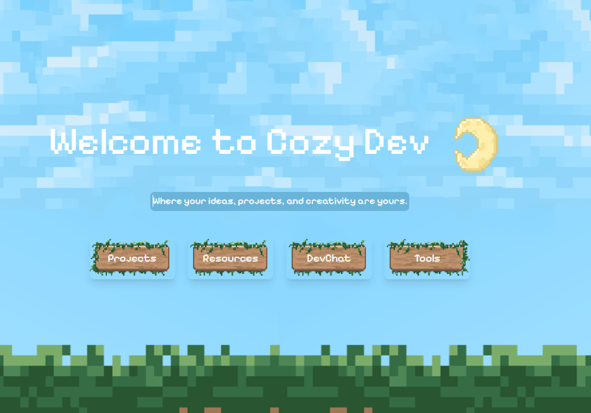

# 🌸CozyDev
✨A personalized productivity dashboard for developers to relax, brainstorm, search, and build — all in one cozy tab.

## Features:

### 🧠 **Burnout Timer**:
*Stay focused with a simple yet effective timer.*
### 🔎 **Multi-Search Widget**:
*Search across Google, GitHub, Wikipedia, and Stack Overflow.*
### 📋 **Pinboard/Forums**:
*Save notes, links, and todos, ask questions.*
### 🛡️ **Secure Database Management**: 
*CozyDev uses Supabase as a powerful open-source backend that handles user authentication and real-time data securely. With Supabase Auth cookies configured via supabase-ssr, user sessions are protected. When deployed with Vercel, environment variables remain encrypted and securely managed in the cloud, ensuring seamless and safe production deployment.*

`` Cozy-inspired layout and pastel themes ``

### 🛠️ Tech Stack
- Next.js
- Supabase
- Tailwind
- Vercel
- Javascript
- Type Script
- CSS, HTML 
- APIs; Google, StackOverflow, Git Hub

## 🚀 Getting Started

#### 1. Sign up with an account!
https://cozydev.vercel.app/
 
#### 2. Project Dashboards!
Create projects, track to-do tasks via a timeline, see latest git commits, sticky notes, and more!

#### 3. Cozy Community!
Talk to others in the community and post to other cozy coders!

#### 4. Coder Self-Care!

Take a break with our burnout timer and other widgets!
#### 5. Resources all on one place!
Deploy instantly with Vercel — auto integrates with Supabase.

#####  📄 License??
##### This project is open-sourced under the MIT License.

#### Inspiration & Vision
We wanted to build a space that feels like a quiet café corner for developers:
 Simple tools. Smart features. A cozy vibe. ✨

__Team:__ 
*Maddie, Nagina*

# 🙌 Acknowledgments
Supabase Starter Kit & Vercel templates
Dave Grays Next.JS Youtube Tutorials

*CS Girlies Community  💛*